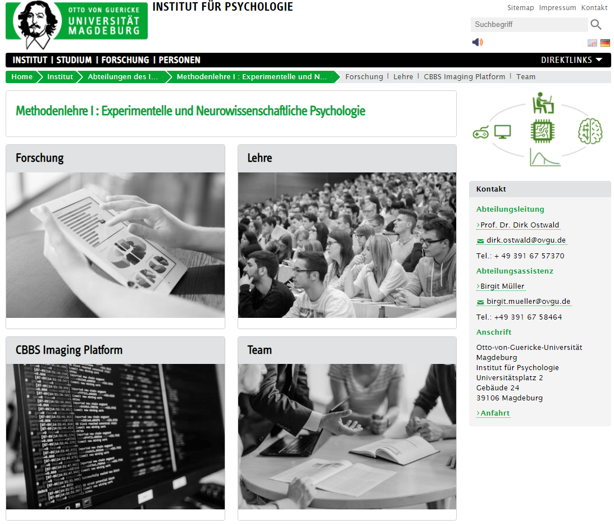

```{r, include = F}
source("0_R_common.R")
```

#  {.plain}
\center
```{r, echo = FALSE, out.width = "20%"}
knitr::include_graphics("0_Abbildungen/pfm_0_otto.png")
```

\vspace{2mm}

\Large
Psychologische Forschungsmethoden
\vspace{6mm}

\normalsize
BSc Philosophie-Neurowissenschaften-Kognition WiSe 22/23

BSc Psychologie WiSe 22/23

\large
\vspace{6mm}
Prof. Dr. Dirk Ostwald

#  {.plain}
\Huge
\vfill
\center
\textcolor{red}{Aufnahme läuft!}
\vfill

#  {.plain}

\vfill
\center
\huge
\textcolor{black}{(0) Formalia}
\vfill

# Formalia
\vfill
\begin{large}
Prof. Dr. Dirk Ostwald (dirk.ostwald@ovgu.de)
\end{large}
\vspace{.7cm}

\begin{minipage}{.3\linewidth}
\begin{center}
\includegraphics[scale=.6]{0_Abbildungen/pfm_0_dirk.pdf}
\end{center}
\end{minipage}
\begin{minipage}{.7\linewidth}
\begin{small}
\renewcommand{\arraystretch}{1.3}
\begin{tabular}{ll}
Seit 2021 	& W2 Professur Methodenlehre I				      \\
2014 - 2020 & W1 Professur Freie Universität Berlin 	  \\
2010 - 2014 & Postdoc BCCN \& MPIB Berlin				        \\
2007 - 2010 & PhD Psychologie Birmingham				        \\
2004 - 2006 & MSc Neurowissenschaften Tübingen			    \\
2005 - 2012 & BSc Mathematik Hagen						          \\
2000 - 2003 & BSc Medizin Hamburg						            \\
\end{tabular}
\end{small}
\end{minipage}
\vspace{.7cm}

\begin{large}
\begin{tabular}{ll}
Forschung 	& Komputationale Kognitive Neurowissenschaften	\\
Lehre 		  & Datenwissenschaft
\end{tabular}
\end{large}
\vfill

#
\large
[\textcolor{darkblue}{Homepage}](https://www.ipsy.ovgu.de/methodenlehre_I-path-980,1404.html)
\vspace{2mm}

```{r, echo = FALSE, out.width = "70%"}

```


# Formalia

\large
\setstretch{2}
\textcolor{darkblue}{Terminierung der Vorlesung}

\normalsize
* Mögliche Live-Alternativen: Do 9 - 11 Uhr, Do 11 - 13 Uhr, Fr 14 - 16 Uhr
* Vorlesung online verfügbar
* Verlegung abhängig von Raumverfügbarkeit

\textcolor{darkblue}{Bitte organisieren Sie sich und weisen Sie eine Mehrheitsentscheidung digital nach!}


# Formalia
\vspace{2mm}
\textcolor{darkblue}{Datenanalytisches Curriculum im 1. Studienjahr BSc Psychologie}
\small
\setstretch{1.6}

\underline{Erstes Semester}

* Vorkurs Fit für Psychologie 
  * \small Mathematische und informatische Grundlagen
* \textcolor{darkblue}{A2. Einführung in die Forschungsmethoden der Psychologie}
  * \small \textcolor{darkblue}{Das Große Ganze zur wissenschaftlichen Psychologie und Messtheorie}
* B1. Deskriptivstatistik
  * \small Wahrscheinlichkeitstheorie und Frequentistische Inferenz
* C1. Einführung in empirisch-wissenschaftliches Arbeiten 
  * \small Programmierung und Deskriptive Statistik

\vspace{-1mm}
\underline{Zweites Semester}

* B2. Inferenzstatistik 
  * \small Das Allgemeine Lineare Modell
* C2. Einführung in empirisch-wissenschaftliches Arbeiten 
  * \small Dokumentation und Präsentation


# Formalia
\textcolor{darkblue}{Modul A2. Einführung in die Forschungsmethoden der Psychologie}
\setstretch{2}

* Donnerstag 7.00 - 9.00 Uhr in Raum G40B-238 (?)
* Kursmaterialien (Folien, Videos, RMarkdown Code) auf der [\textcolor{darkblue}{Kurswebseite}](https://bit.ly/3T6BcoQ)
* Code auf [\textcolor{darkblue}{Github}](https://github.com/dirk-ostwald/psychologische-forschungsmethoden-23)
* Ankündigungen über die [\textcolor{darkblue}{Moodleseite}](https://elearning.ovgu.de/course/view.php?id=13818)
* [\textcolor{darkblue}{Link zum Kurs Mathematische Grundlagen}](https://bit.ly/3SNh3nR)
* [\textcolor{darkblue}{Link zur vorherigen Iteration des Kurses}](https://bit.ly/3MmsfFK) 

\flushright
$\Rightarrow$ Grundlegende Überarbeitung im WiSe 22/23! 


# Formalia {.t}
\vspace{1mm}
\textcolor{darkblue}{Vorläufige Vorlesungsübersicht}

\small
\center
\footnotesize
\renewcommand{\arraystretch}{1.1}
\begin{tabular}{lll}
Datum        & Einheit                       & Thema				                            \\\hline
13.10.2022   & Formalia                      & (0) Formalia                             \\
13.10.2022   & Psychologische Wissenschaft   & (1) Wissenschaft                         \\
20.10.2022   & Psychologische Wissenschaft   & (2) Psychologische Forschung    	        \\
27.10.2022   & Psychologische Wissenschaft   & (3) Psychologische Daten                 \\
03.11.2022   & Messtheorie                   & (4) Grundlagen                           \\
10.11.2022   & Messtheorie                   & (5) Nominales Messen                     \\
17.11.2022   & Messtheorie                   & (6) Ordinales Messen                     \\
24.11.2022   & Messtheorie                   & (7) Extensives Messen                    \\
01.12.2022   & Messtheorie                   & (8) Differenzmessungen                   \\
08.12.2022   & Messtheorie                   & (9) Praktische Messtheorie               \\
15.12.2022   & Stichprobentheorie            & (10) Grundlagen                          \\
05.01.2023   & Stichprobentheorie            & (11) Stratifizierte Stichproben          \\
12.01.2023   & Stichprobentheorie            & (12) Cluster Stichproben                   \\
19.01.2023   & Quasiexperimentelle Methoden  & (13) Grundlagen                          \\
26.01.2023   & Quasiexperimentelle Methoden  & (14) Propensity Scores                   \\\hline
Feb  2023    & Klausurtermin                 &                                          \\
Juli 2023    & Klausurwiederholungstermin    &
\end{tabular}

# Formalia
\textcolor{darkblue}{Modul A2. Einführung in die Forschungsmethoden der Psychologie}
\setstretch{2}

* Vorlesungsfolien inklusive Selbstkontrollfragen sind klausurrelevant
* Selbstkontrollfragen fokussieren den Kursinhalt 
* Selbstkontrollfragen sind Grundlage für Prüfungsfragen
* Benotete Multiple Choice Klausur (20 Fragen) Ende WiSe 2022/23
* Gemeinsame Klausur mit Modul A1. Einführung in die Psychologie und ihre Geschichte
* Klausurwiederholungstermin am Ende SoSe 2023
* Klausurtermin und Klausurort gemäß Prüfungsplan des [FNW Prüfungsamtes](https://www.fnw.ovgu.de/Studium/Pr%C3%BCfungsamt.html)

# Formalia
\Huge
\vfill
\center
Q & A
\vfill


