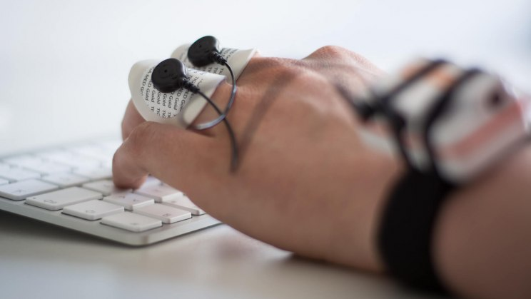
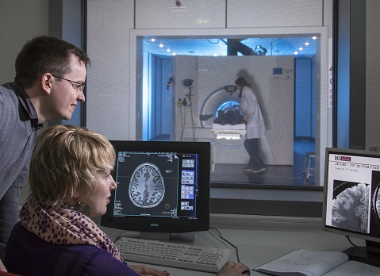

```{r, include = F}
source("3_R_common.R")
```

#  {.plain}
\center
```{r, echo = FALSE, out.width = "20%"}
knitr::include_graphics("3_Abbildungen/pfm_3_otto.png")
```

\vspace{2mm}

\Large
Psychologische Forschungsmethoden
\vspace{6mm}

\normalsize
BSc Philosophie-Neurowissenschaften-Kognition WiSe 2022/23

BSc Psychologie WiSe 2022/23

\large
\vspace{6mm}
Prof. Dr. Dirk Ostwald

#  {.plain}

\vfill
\center
\huge
\textcolor{black}{(3) Psychologische Daten}
\vfill

# 
\Large
\setstretch{3}
\vfill
Überblick

Verhaltensdaten

Physiologische Daten

Selbstkontrollfragen
\vfill


# Überblick
```{r, echo = FALSE, out.width = "100%"}
knitr::include_graphics("3_Abbildungen/pfm_3_psychologie.pdf")
```

# Überblick 
```{r, echo = FALSE, out.width = "90%"}
knitr::include_graphics("3_Abbildungen/pfm_3_moderne_psychologie.pdf")
```

# Überblick
```{r, echo = FALSE, out.width = "100%"}
knitr::include_graphics("3_Abbildungen/pfm_3_modellbasierte_datenwissenschaft.pdf")
```

# Überblick
\textcolor{darkblue}{Psychologische Daten}

\small
Der Umgang mit Forschungsdaten im Fach Psychologie (DPGS Stellungnahme 2017)

\footnotesize
*Felix Schönbrodt, Mario Gollwitzer und Andrea Abele-Brehm (2017) Psychologische Rundschau* 

\justifying (...) Rohdaten sind die Ursprungsaufzeichnungen, z.B. Kreuze auf einem 
Papierfragebogen, Zeichnungen oder auch Audio- oder Videoaufnahmen. Mit Primärdaten 
ist die erste 
Übertragung der Rohdaten in ein digitales Format gemeint, also z.B. Code „1“ für 
eine Ja-Antwort usw.

Somit sind Primärdaten in der Psychologie vollkommen unbearbeitete (...)  quantitative und qualitative Daten, zum Beispiel

* \justifying bei Experimenten alle manipulierten und gemessenen Variablen für jeden Experimentaldurchgang jeder Person;
* bei Fragebögen die Antworten jeder Person auf jedem Item;
* bei Freitext-Eingaben der Originalwortlaut (...);
* digitalisierte Videoaufnahmen (...);
* Downloads oder Screenshots von Inhalten sozialer Medien (...);
* bei (neuro)physiologischen Daten (wie EEG- oder fMRT-Daten) verlustfrei umgewandelte Daten 
  in einem standardisierten Rohdatenformat (...), die nicht aggregiert
  sind und nicht nur auf wenige „regions of interest“ beschränkt sind.

\flushright
@schoenbrodt_2017

# Überblick
\textcolor{darkblue}{Das deutsche psychologische Dateninstitut}

\small
Leibniz-Institut für Psychologie in Trier der [\textcolor{blue}{Leibniz Gemeinschaft}](https://www.leibniz-gemeinschaft.de/)

* Bis 2020: Leibniz-Zentrum für Psychologische Information und Dokumentation (ZPID) 

```{r, echo = FALSE, out.width = "80%"}

```

\flushright
\tiny
[Von Mitchell 1985 - Eigenes Werk, CC BY-SA 4.0](https://commons.wikimedia.org/w/index.php?curid=7048518)

# Überblick
\textcolor{darkblue}{Das deutsche psychologische Dateninstitut}
 
```{r, echo = FALSE, out.width = "65%"}

```

# Überblick
\textcolor{darkblue}{Psychologische Daten = Observierbare Variablen}
\vspace{1mm}
```{r, echo = FALSE, out.width = "85%"}
knitr::include_graphics("3_Abbildungen/pfm_3_latente_variablen.pdf")
```

# Überblick
\vspace{2mm}
\textcolor{darkblue}{Psychologische Datentypen}
\vspace{-2mm}
```{r, echo = FALSE, out.width = "100%"}
knitr::include_graphics("3_Abbildungen/pfm_3_psychologische_daten.pdf")
```

# Überblick
\textcolor{darkblue}{Datenaufnahmeraum}
\vspace{-1mm}
```{r, echo = FALSE, out.width = "85%"}
knitr::include_graphics("3_Abbildungen/pfm_3_datenaufnahmeraum.pdf")
```

# 
\Large
\setstretch{3}
\vfill
Überblick

**Verhaltensdaten**

Physiologische Daten

Selbstkontrollfragen
\vfill

# Verhaltensdaten
\setstretch{1.7}
\textcolor{darkblue}{Beobachtungsdaten}

* Analoge strukturierte Fremdbeobachtung
* Analoge strukturierte Selbstbeobachtung (Tagebucheinträge)
* Digitale strukturierte Selbstbeobachtung (Ambulatory Assessment)
* Computer-basierte Verhaltensparadigmen (Psychophysik, Verhaltenökonomie)
* Computerspieldaten

\textcolor{darkblue}{Befragungsdaten}

* Mündliches Interview
* Schriftliches Interview
* Psychologische Tests und Fragebögen

# Verhaltensdaten
Beobachtungsdaten | Psychophysik und Verhaltensökonomie
\vspace{10mm}
```{r, echo = FALSE, out.width = "100%"}
knitr::include_graphics("3_Abbildungen/pfm_3_verhaltensdatenaufnahme.pdf")
```

# Verhaltensdaten
Beobachtungsdaten | Psychophysik und Verhaltensökonomie

\small
Beispieldatensatz

\vspace{1mm}
\footnotesize
$n = 8$ Proband:innen, $m = 5$ binäre Entscheidungen, mögliche Antworten als Elemente in $\{0,1\}$ kodiert 
\vspace{1mm}
```{r, echo  = F}
# Datenbeispielgeneration
n           = 8                                                                  # Anzahl Zeilen
m           = 5                                                                  # Anzahl Spalten
D           = as.data.frame(matrix(round(runif(n*m, min=0, max=1)), nrow = n))   # Daten
rownames(D) = paste("Probandin"    , as.character(1:n))                          # Zeilenbezeichner  
colnames(D) = paste("Entscheidung" , as.character(1:m))                          # Spaltenbezeichner
knitr::kable(D, "pipe", align = "c")                                             # Datenbeispielvisualisierung
```

# Verhaltensdaten
Befragungsdaten | Psychologische Tests und Fragebögen 
\vspace{-2mm}
```{r, echo = FALSE, out.width = "75%"}
knitr::include_graphics("3_Abbildungen/pfm_3_fragebogen_1.pdf")
```

# Verhaltendaten
\vspace{1mm}
Befragungsdaten | Psychologische Tests und Fragebögen
\vspace{-3mm}
```{r, echo = FALSE, out.width = "40%"}
knitr::include_graphics("3_Abbildungen/pfm_3_fragebogen_2.pdf")
```
\vspace{-3mm}
\flushright
\tiny
Nilges, P. & Essau, C. (2021). DASS. Depressions-Angst-Stress-Skalen - deutschsprachige
Kurzfassung [Verfahrensdokumentation und Fragebogen mit Auswertung]. In Leibniz-Institut für
Psychologie (ZPID) (Hrsg.), Open Test Archive. Trier: ZPID.
https://doi.org/10.23668/psycharchives.4579

# Verhaltensdaten
Befragungsdaten | Psychologische Tests und Fragebögen 

\small
Beispieldatensatz

\footnotesize
\vspace{1mm}
$n = 8$ Proband:innen, $m = 5$ Fragen, mögliche Antworten als Elemente in $\mathbb{N}_7$ kodiert 
\vspace{1mm}
```{r, echo  = F}
# Datenbeispielgeneration
n           = 8                                                                  # Anzahl Zeilen
m           = 5                                                                  # Anzahl Spalten
D           = as.data.frame(matrix(round(runif(n*m, min=1, max=7)), nrow = n))   # Daten
rownames(D) = paste("Proband:in", as.character(1:n))                             # Zeilenbezeichner  
colnames(D) = paste("Frage"    , as.character(1:m))                              # Spaltenbezeichner
knitr::kable(D, "pipe", align = "c")                                             # Datenbeispielvisualisierung
```

# 
\Large
\setstretch{3}
\vfill
Überblick

Verhaltensdaten

**Physiologische Daten**

Selbstkontrollfragen
\vfill


# Physiologische Daten
\setstretch{1.8}
\textcolor{darkblue}{Vegetativphysiologische Daten}

* Medizinische Befunde 
* Hormonspiegel
* Immunmarker 
* Hautleitwiderstand

\textcolor{darkblue}{Neurophysiologische Daten}

* Elektroenzephalographie (EEG)
* Magnetoenzephalographie (MEG)
* Funktionelle Magnetresonanztomographie (fMRT)
* Magnet- und Gleichstromstimulationsverfahren (TMS, tCDS)

# Physiologische Daten
Vegetativphysiologische Daten | Hautleitwiderstand  
\vspace{5mm}


```{r, echo = FALSE, out.width = "75%"}

```


# Physiologische Daten
Vegetativphysiologische Daten | Hautleitwiderstand 

\small
Beispieldatensatz

\footnotesize
\vspace{1mm}
$1$ Fingerelektrode, $n = 8$ Proband:innen, $m = 7$ Messzeitpunkte (2 ms), mögliche Werte in $\mathbb{R}$ ($\mu V$) kodiert 
\vspace{1mm}
```{r, echo  = F}
# Datenbeispielgeneration
n           = 8                                                                  # Anzahl Zeilen
m           = 7                                                                  # Anzahl Spalten
D           = as.data.frame(matrix(runif(n*m, min=1, max=10), nrow = n))         # Daten
rownames(D) = paste("Proband:in", as.character(1:n))                             # Zeilenbezeichner  
colnames(D) = paste(as.character(2*(0:(m-1))), "ms")                             # Spaltenbezeichner
knitr::kable(D, "pipe", align = "c")                                             # Datenbeispielvisualisierung
```

# Physiologische Daten
Neurophysiologische Daten | EEG
\vspace{5mm}

```{r, echo = FALSE, out.width = "70%"}

```

# Physiologische Daten
Neurophysiologische Daten | EEG

```{r, echo = FALSE, out.width = "80%"}
knitr::include_graphics("3_Abbildungen/pfm_3_eeg_aufnahme.pdf")
```


# Physiologische Daten
Neurophysiologische Daten | EEG

```{r, echo = FALSE, out.width = "80%"}
knitr::include_graphics("3_Abbildungen/pfm_3_eeg_biologie.pdf")
```


# Physiologische Daten
Neurophysiologische Daten | EEG

\small
Beispieldatensatz

\footnotesize
\vspace{1mm}
$1$ Proband:in, $n = 8$ Elektroden, $m = 7$ Messzeitpunkte (2 ms), mögliche Werte in $\mathbb{R}$ ($\mu V$) kodiert 
\vspace{1mm}
```{r, echo  = F}
# Datenbeispielgeneration
n           = 8                                                                  # Anzahl Zeilen
m           = 7                                                                  # Anzahl Spalten
D           = as.data.frame(matrix(runif(n*m, min=-2, max=10), nrow = n))        # Daten
rownames(D) = paste("Elektrode", as.character(1:n))                              # Zeilenbezeichner  
colnames(D) = paste(as.character(2*(0:(m-1))), "ms")                             # Spaltenbezeichner
knitr::kable(D, "pipe", align = "c")     
```


# Physiologische Daten
Neurophysiologische Daten | fMRT
\vspace{5mm}

```{r, echo = FALSE, out.width = "70%"}

```

# Physiologische Daten
Neurophysiologische Daten | fMRT
\vspace{1mm}

```{r, echo = FALSE, out.width = "80%"}
knitr::include_graphics("3_Abbildungen/pfm_3_fmrt_aufnahme.pdf")
```

# Physiologische Daten
Neurophysiologische Daten | fMRT
\vspace{3mm}

```{r, echo = FALSE, out.width = "90%"}
knitr::include_graphics("3_Abbildungen/pfm_3_fmrt_biophysik.pdf")
```


# Physiologische Daten
Neurophysiologische Daten | fMRT

\small
Beispieldatensatz

\footnotesize
\vspace{1mm}
$1$ Proband:in, $n = 8$ Voxel, $m = 7$ Messzeitpunkte (1.5 s), mögliche Werte in $\mathbb{N}_{255}$ kodiert 
\vspace{1mm}
```{r, echo  = F}
# Datenbeispielgeneration
n           = 8                                                                  # Anzahl Zeilen
m           = 7                                                                  # Anzahl Spalten
D           = as.data.frame(matrix(round(runif(n*m, min=0, max=255)), nrow = n)) # Daten
rownames(D) = paste("Voxel", as.character(1:n))                                  # Zeilenbezeichner  
colnames(D) = paste(as.character(1.5*(0:(m-1))), "s")                            # Spaltenbezeichner
knitr::kable(D, "pipe", align = "c")     
```

# Überblick
\vspace{2mm}
\textcolor{darkblue}{Psychologische Datentypen}
\vspace{-2mm}
```{r, echo = FALSE, out.width = "100%"}
knitr::include_graphics("3_Abbildungen/pfm_3_psychologische_daten.pdf")
```

# 
\Large
\setstretch{3}
\vfill
Überblick

Verhaltensdaten

Physiologische Daten

**Selbstkontrollfragen**
\vfill

# Selbstkontrollfragen
\small
\setstretch{3}
1. Erläutern Sie die Begriffe der latenten und der observierbaren Variable.
2. Erläutern Sie die Begriffe der Operationalisierung und der Inferenz.
3. Erläutern Sie das Modell eines zweidimensionalen Datenaufnahmeraums.
4. Nennen sie drei Arten von Verhaltensbeobachtungsdaten.
5. Nennen sie drei Arten von Verhaltensbefragungsdaten.
6. Nennen sie drei Arten von vegetativphysiologischen Daten.
7. Nennen sie drei Arten von neurophysiologische Daten.

# Referenzen
\footnotesize